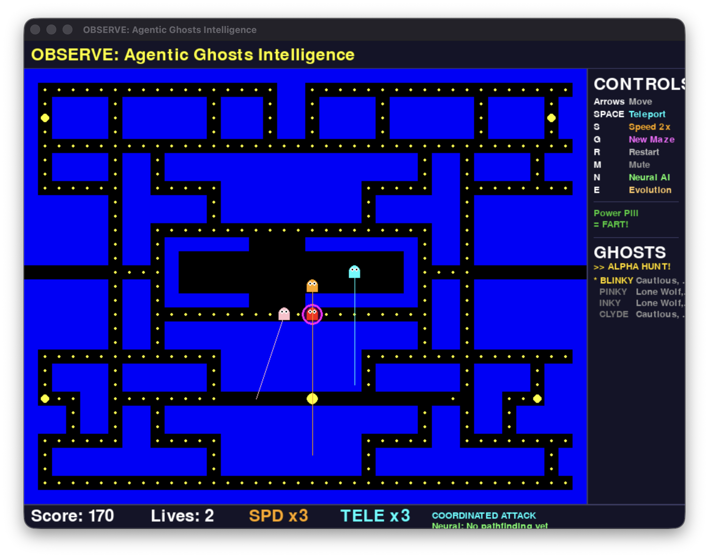
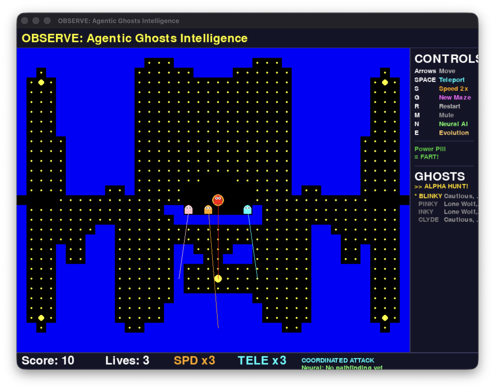
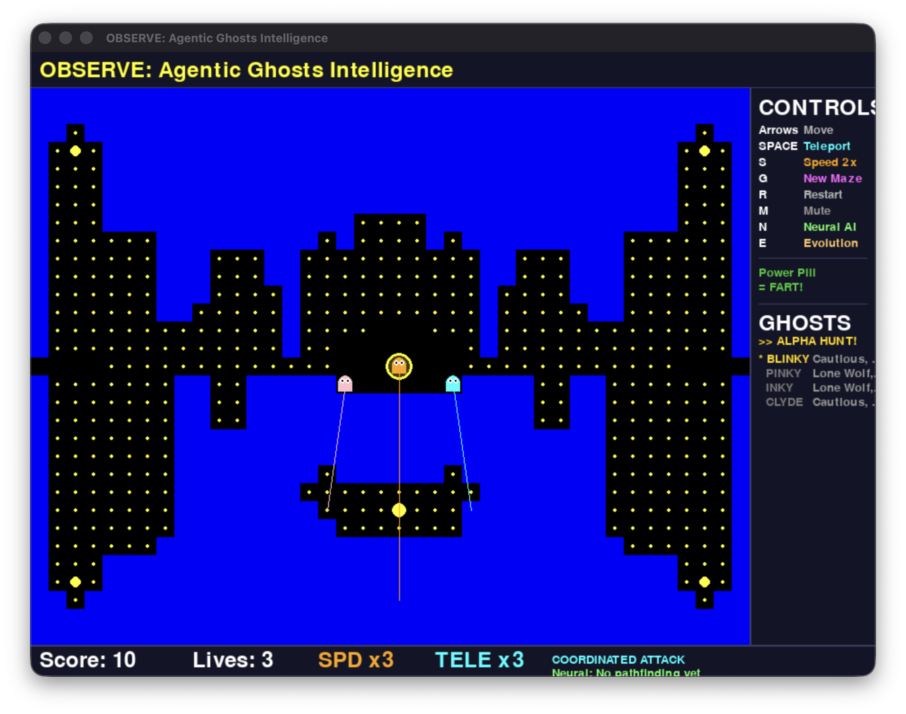
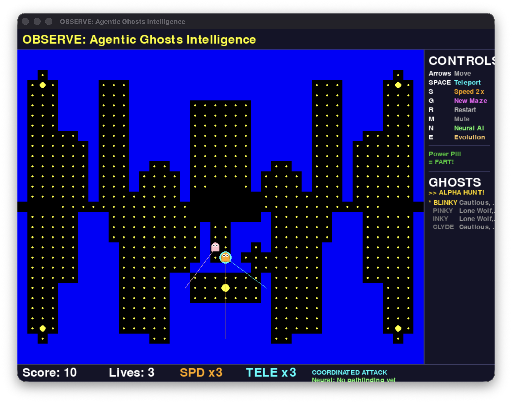
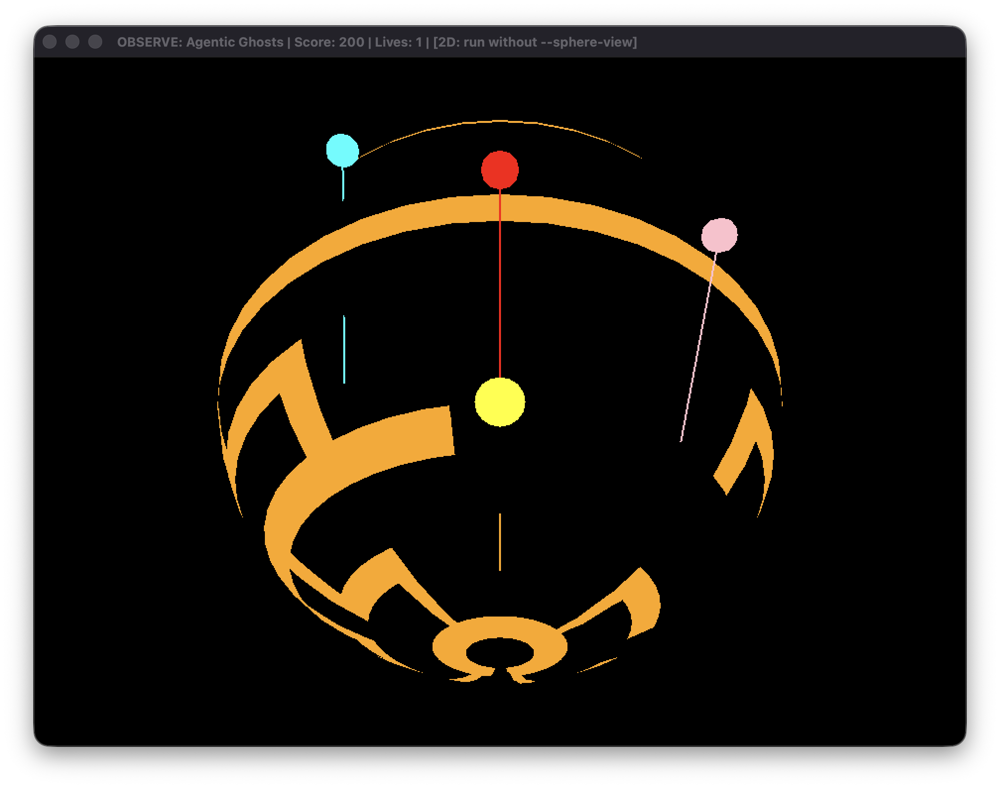
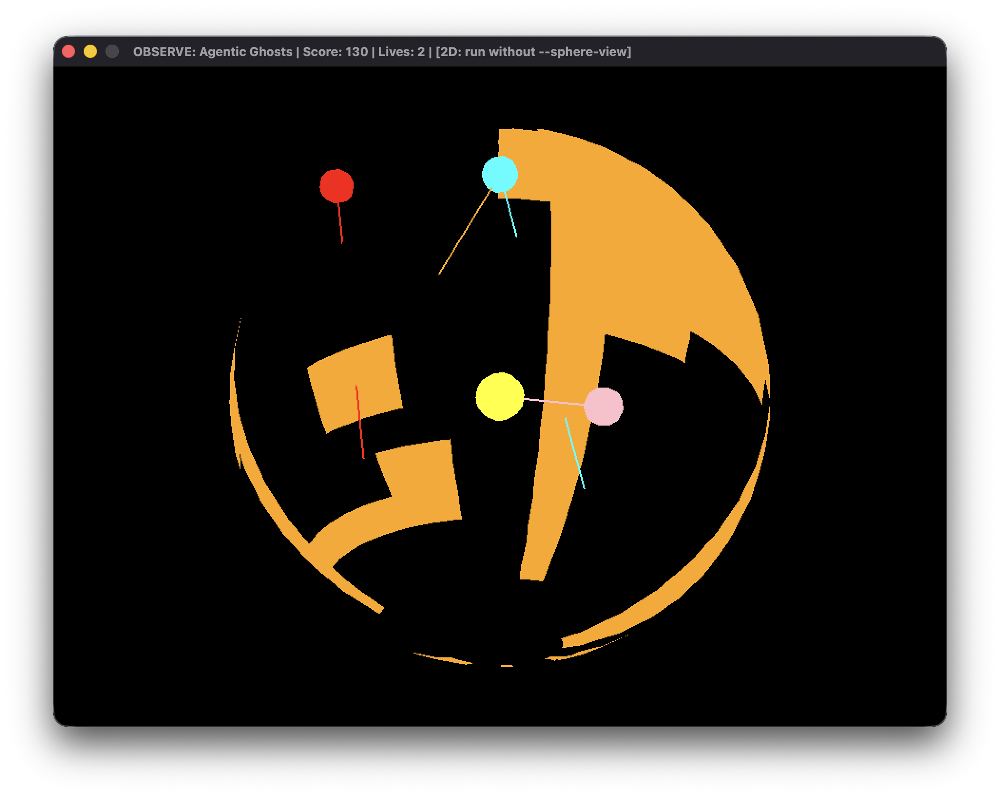
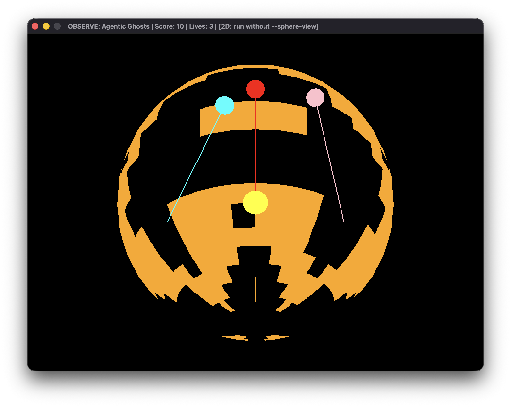
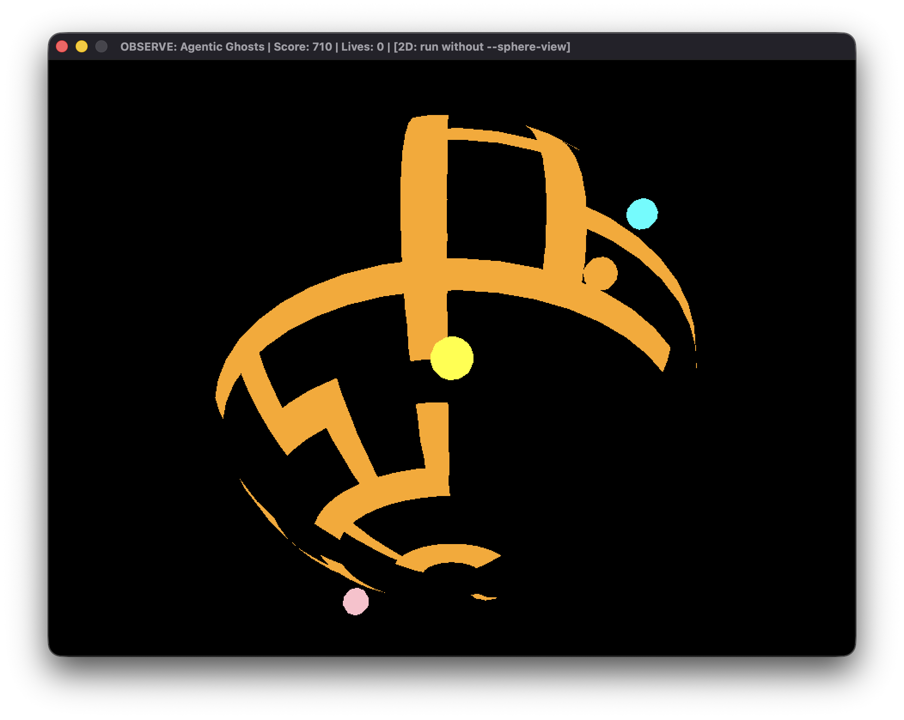

# 🎮 Pacman ML - Autonomous Agent Architecture

A classic Pacman game featuring **autonomous ML-powered agents** using Reinforcement Learning and Unsupervised Learning. No LLM or NLP required — pure machine learning for game AI.

---

## 🏗️ ML Architecture Overview

```
┌────────────────────────────────────────────────────────────────────────────┐
│                              GAME LAYER                                    │
│                    Pygame / HTML5 Canvas / Streamlit                       │
├────────────────────────────────────────────────────────────────────────────┤
│                                                                            │
│    ┌──────────────────────────────────────────────────────────────────┐   │
│    │                     AGENT LAYER                                   │   │
│    │                                                                   │   │
│    │   ┌─────────────────┐         ┌─────────────────┐                │   │
│    │   │   Ghost Agent   │         │   Multi-Agent   │                │   │
│    │   │    (RL: PPO)    │────────▶│   Coordinator   │                │   │
│    │   │                 │         │                 │                │   │
│    │   │  • Policy Net   │         │  • 4 Ghosts     │                │   │
│    │   │  • Value Net    │         │  • Behaviors    │                │   │
│    │   │  • Action Pred  │         │  • Coordination │                │   │
│    │   └─────────────────┘         └─────────────────┘                │   │
│    │            │                                                      │   │
│    └────────────┼──────────────────────────────────────────────────────┘   │
│                 │                                                          │
│    ┌────────────┼──────────────────────────────────────────────────────┐   │
│    │            ▼         UNSUPERVISED LAYER                           │   │
│    │                                                                   │   │
│    │   ┌─────────────────┐         ┌─────────────────┐                │   │
│    │   │  State Encoder  │         │ Pattern Learner │                │   │
│    │   │                 │         │                 │                │   │
│    │   │  • PCA (dim     │         │  • DBSCAN       │                │   │
│    │   │    reduction)   │         │    clustering   │                │   │
│    │   │  • K-Means      │         │  • Anomaly      │                │   │
│    │   │    clustering   │         │    detection    │                │   │
│    │   └─────────────────┘         └─────────────────┘                │   │
│    │                                                                   │   │
│    └───────────────────────────────────────────────────────────────────┘   │
│                                                                            │
│    ┌───────────────────────────────────────────────────────────────────┐   │
│    │                        ML CORE                                    │   │
│    │                                                                   │   │
│    │   ┌─────────────┐  ┌─────────────┐  ┌─────────────┐              │   │
│    │   │   PyTorch   │  │  Gymnasium  │  │Scikit-learn │              │   │
│    │   │             │  │             │  │             │              │   │
│    │   │ Neural Nets │  │ RL Environ- │  │ Clustering  │              │   │
│    │   │ SB3 Algos   │  │ ment API    │  │ PCA, KMeans │              │   │
│    │   └─────────────┘  └─────────────┘  └─────────────┘              │   │
│    │                                                                   │   │
│    └───────────────────────────────────────────────────────────────────┘   │
│                                                                            │
└────────────────────────────────────────────────────────────────────────────┘
```
---

## 📸 Neuro-Adaptive-Ghosts-ML

### 2D gameplay

| | |
|:---:|:---:|
|  |  |
| *OBSERVE: Agentic Ghosts — coordinated chase* | *Alpha pack hunting & roles* |
|  |  |
| *Power pellet & ghost evolution* | *Neural pathfinding & maze* |

### 3D sphere view (`--sphere-view`)

| | |
|:---:|:---:|
|  |  |
| *3D sphere — play surface* | *Camera follows player* |
|  |  |
| *Hunting lines on sphere* | *Wrap & chase in 3D* |

---

## 🧠 ML Components Explained

### 1. Reinforcement Learning Agent (`agents/ghost_agent.py`)

The ghost agent learns to chase Pacman through trial and error using **Proximal Policy Optimization (PPO)**.

```
┌─────────────────────────────────────────────────────────────┐
│                    PPO ARCHITECTURE                         │
│                                                             │
│   Observation ──▶ ┌────────────┐    ┌────────────┐         │
│   (game state)    │  Policy    │    │   Value    │         │
│                   │  Network   │    │  Network   │         │
│   • Maze grid     │            │    │            │         │
│   • Pacman pos    │  256 ──▶ 256   │  256 ──▶ 256         │
│   • Ghost pos     │     │      │    │     │      │         │
│   • Frightened    └─────┼──────┘    └─────┼──────┘         │
│                         │                 │                 │
│                         ▼                 ▼                 │
│                    ┌─────────┐      ┌──────────┐           │
│                    │ Action  │      │  State   │           │
│                    │ (0-3)   │      │  Value   │           │
│                    └─────────┘      └──────────┘           │
│                    UP/DOWN/          Expected              │
│                    LEFT/RIGHT        reward                │
└─────────────────────────────────────────────────────────────┘
```

**Reward Structure:**
| Event | Reward | Purpose |
|-------|--------|---------|
| Move closer to Pacman | +0.1 | Encourage chasing |
| Catch Pacman | +50.0 | Main objective |
| Hit wall | -0.1 | Avoid invalid moves |
| Get eaten (frightened) | -10.0 | Avoid power pellets |

**Supported Algorithms:**
- **PPO** (default) - Stable, general purpose
- **DQN** - Good for discrete actions
- **A2C** - Faster training

---

### 2. Gymnasium Environment (`environments/pacman_env.py`)

Standard RL interface that wraps the Pacman game for training.

```
┌─────────────────────────────────────────────────────────────┐
│                 GYMNASIUM ENVIRONMENT                       │
│                                                             │
│   ┌─────────────┐     step(action)      ┌─────────────┐    │
│   │             │ ───────────────────▶  │             │    │
│   │    Agent    │                       │    Game     │    │
│   │             │ ◀───────────────────  │             │    │
│   └─────────────┘   obs, reward, done   └─────────────┘    │
│                                                             │
│   Observation Space:                                        │
│   • Maze grid (40×31 = 1240 values)                        │
│   • Pacman position (2 values, normalized)                  │
│   • Ghost positions (8 values, 4 ghosts × 2)               │
│   • Ghost states (4 values, frightened flags)              │
│   Total: 1254 dimensional vector                           │
│                                                             │
│   Action Space: Discrete(4)                                │
│   • 0 = UP                                                  │
│   • 1 = DOWN                                                │
│   • 2 = LEFT                                                │
│   • 3 = RIGHT                                               │
└─────────────────────────────────────────────────────────────┘
```

---

### 3. State Encoder (`unsupervised/state_encoder.py`)

Reduces the dimensionality of game states and clusters similar situations.

```
┌─────────────────────────────────────────────────────────────┐
│                    STATE ENCODER                            │
│                                                             │
│   Raw State           PCA              K-Means              │
│   (1254 dims)    ──▶  (32 dims)   ──▶  (20 clusters)       │
│                                                             │
│   ┌───────────┐      ┌───────────┐     ┌───────────┐       │
│   │ █████████ │      │ ████      │     │  Cluster  │       │
│   │ █████████ │ ──▶  │ ████      │ ──▶ │    ID     │       │
│   │ █████████ │      │ ████      │     │   (0-19)  │       │
│   └───────────┘      └───────────┘     └───────────┘       │
│                                                             │
│   Benefits:                                                 │
│   • Faster learning (smaller state space)                  │
│   • Similar states grouped together                        │
│   • Interpretable clusters                                  │
└─────────────────────────────────────────────────────────────┘
```

**Cluster Examples:**
- Cluster 0: "Ghost nearby, escape route available"
- Cluster 5: "Power pellet active, ghosts frightened"
- Cluster 12: "Dead end, ghost approaching"

---

### 4. Pattern Learner (`unsupervised/pattern_learner.py`)

Discovers movement patterns and detects anomalies using trajectory clustering.

```
┌─────────────────────────────────────────────────────────────┐
│                   PATTERN LEARNER                           │
│                                                             │
│   Trajectories        DBSCAN           Patterns             │
│   (10 steps each)  ──────────▶        Discovered            │
│                                                             │
│   ┌─────────────┐                  ┌─────────────────────┐  │
│   │ → → ↓ ↓ ← │  ──▶  Cluster 0:  │ "Patrol pattern"    │  │
│   │ → → ↓ ↓ ← │       (Similar    │ Ghosts patrolling   │  │
│   └─────────────┘       paths)     │ fixed routes        │  │
│                                    └─────────────────────┘  │
│   ┌─────────────┐                  ┌─────────────────────┐  │
│   │ ↑ ↑ ↑ → → │  ──▶  Cluster 1:  │ "Chase pattern"     │  │
│   │ ↑ ↑ → → → │       (Direct     │ Moving toward       │  │
│   └─────────────┘       pursuit)   │ Pacman              │  │
│                                    └─────────────────────┘  │
│                                                             │
│   Anomaly Detection (LOF):                                  │
│   • Detects unusual player behavior                        │
│   • Identifies unexpected ghost movements                  │
└─────────────────────────────────────────────────────────────┘
```

---

### 5. Multi-Agent Coordinator (`agents/multi_agent.py`)

Coordinates the behavior of all 4 ghosts. **By default** (no `--ml`), the game uses `CoordinatedGhostSystem`: role-based rule strategies plus alpha pack hunting (closest ghost leads when near Pacman).

```
┌─────────────────────────────────────────────────────────────┐
│                 MULTI-AGENT SYSTEM (default)                 │
│                                                             │
│              ┌─────────────────────┐                        │
│              │    Coordinator      │                        │
│              │  • Roles: Chaser,   │                        │
│              │    Ambusher, Blocker, Patrol                 │
│              │  • Alpha pack hunt  │                        │
│              └──────────┬──────────┘                        │
│                         │                                   │
│         ┌───────────────┼───────────────┐                  │
│         ▼               ▼               ▼                   │
│   ┌──────────┐   ┌──────────┐   ┌──────────┐   ┌────────┐  │
│   │ Blinky   │   │ Pinky    │   │ Inky     │   │ Clyde  │  │
│   │ CHASER   │   │ AMBUSHER │   │ BLOCKER  │   │ PATROL │  │
│   └──────────┘   └──────────┘   └──────────┘   └────────┘  │
│                                                             │
│   With --ml: one ghost uses the loaded RL model; others    │
│   use rule-based behavior (chase/coordination).             │
└─────────────────────────────────────────────────────────────┘
```

---

## 🚀 Quick Start

### Installation

```bash
# Clone and enter directory
cd pacman-ML

# Optional: use a virtual environment
python3 -m venv venv
source venv/bin/activate   # Windows: venv\Scripts\activate

# Install dependencies
pip install -r requirements.txt
```

For the Streamlit web app, install Streamlit: `pip install streamlit`

### Play the Game (Pygame)

The main game runs as **OBSERVE: Agentic Ghosts Intelligence** with coordinated ghost AI by default.

```bash
python3 main.py
# or use the launcher (activates venv if present):
./run-pacman.sh
```

**Pygame controls:**

| Key | Action |
|-----|--------|
| **Arrow keys** | Move Pacman |
| **Space** | Teleport to a safe spot (3 charges) |
| **S** (or Shift) | Super speed 2× (3 charges) |
| **G** | Generate new procedural maze |
| **R** | Restart game |
| **M** | Mute / unmute sound |
| **N** | Toggle neural pathfinding (if available) |
| **E** | Evolution stats; double-press to force evolve |

**Game features:** Power pellets trigger a “power fart” shockwave that eliminates ghosts within half the board width (+400 pts per ghost). By default, ghosts use **coordinated attack** (chaser, ambusher, blocker, patrol) and **alpha pack hunting** (closest ghost leads). Disable coordination with `--no-coord`.

#### 360° play area (torus wrap)

The play area wraps like a **torus**: exit the top to appear at the bottom, exit the bottom to appear at the top, and left/right wrap as well. You can move **North** (up) or **South** (down) from any column at the top or bottom row. No hard edges.

#### Ghost hunting lines

When ghosts are not frightened, **hunting lines** are drawn from each ghost to its target (coordinated mode) or to Pacman (non-coordinated). These lines appear in both the 2D view and the 3D sphere view.

#### 3D sphere view (optional)

The play surface can be rendered on a **3D sphere** with the camera following the player, so the world rotates as you move.

```bash
# Install OpenGL support (optional)
pip install PyOpenGL PyOpenGL-accelerate

# Run in 3D sphere view
python3 main.py --sphere-view
# or
./run-pacman.sh --sphere-view
```

- The maze, dots, Pacman, and ghosts are drawn on the sphere; the camera stays behind Pacman so the view rotates with movement.
- Hunting lines are shown in 3D from each ghost to Pacman (or to their coordination target).
- Score and lives appear in the window title. Without PyOpenGL, the game falls back to the normal 2D view.

### Train ML Agents

```bash
# Train ghost agent (uses training/config.yaml; 5–10 min for 100K steps)
python3 training/train_ghost.py --timesteps 100000

# Custom config and save path
python3 training/train_ghost.py --config training/config.yaml --save-path models/ghost_agent --timesteps 500000

# Skip state-encoder training
python3 training/train_ghost.py --timesteps 100000 --no-encoder
```

### Play With ML Ghosts

```bash
python3 main.py --ml --model models/ghost_agent/best_model.zip
```

To disable coordinated attacks and use only ML/rule mix:  
`python3 main.py --ml --model models/ghost_agent/best_model.zip --no-coord`

### Running in Docker

**Web version (HTML5)** — runs in any environment; you play in the browser:

```bash
docker build -f Dockerfile.web -t pacman-web .
docker run -p 8000:8000 pacman-web
# Open http://localhost:8000
```

**Pygame version (full game)** — needs a display:

- **Linux (X11):** Share the host display so the game window appears on your machine.
  ```bash
  docker build -t pacman-ml .
  xhost +local:docker
  docker run -e DISPLAY=$DISPLAY -v /tmp/.X11-unix:/tmp/.X11-unix --rm pacman-ml
  ```
- **macOS / Windows:** Docker has no native display. Use the **web version** (above) or run the game locally (e.g. `./run-pacman.sh`).

---

## ⚙️ Configuration (`training/config.yaml`)

The training script `train_ghost.py` reads `training/config.yaml` by default. You can override with `--config`.

```yaml
# Environment settings
environment:
  agent_type: ghost   # 'ghost' or 'pacman'
  n_envs: 4           # Parallel environments
  max_steps: 1000     # Max steps per episode

# RL Agent
agent:
  algorithm: ppo      # ppo, dqn, or a2c
  device: auto        # auto, cpu, cuda
  learning_rate: 0.0003
  n_steps: 2048
  batch_size: 64
  n_epochs: 10        # PPO only
  gamma: 0.99
  policy_kwargs:
    net_arch:
      pi: [256, 256]
      vf: [256, 256]

# Training
training:
  total_timesteps: 500000
  log_freq: 5000
  eval_freq: 10000
  eval_episodes: 5
  save_freq: 50000

# Unsupervised (state encoder + pattern learner)
unsupervised:
  state_encoder:
    n_components: 32
    n_clusters: 20
    use_minibatch: true
  pattern_learner:
    trajectory_length: 10
    min_cluster_size: 5
    use_hdbscan: false

# Paths
paths:
  models_dir: models/
  logs_dir: logs/
  data_dir: data/
```

---

## 📊 Training Metrics

During training, you'll see:

```
Step 5000:  Mean reward = 12.34, Mean length = 245
Step 10000: Mean reward = 18.56, Mean length = 312
Step 15000: Mean reward = 25.78, Mean length = 456
...
```

| Metric | Description | Good Value |
|--------|-------------|------------|
| Mean Reward | Average episode reward | > 30 |
| Mean Length | Average episode steps | > 400 |
| Policy Loss | How well policy improves | Decreasing |
| Value Loss | How well value predicts | Decreasing |

---

## 🎮 Game Versions

| Version | Command | Controls | ML / coordination |
|---------|---------|----------|-------------------|
| Pygame (default) | `python3 main.py` or `./run-pacman.sh` | Arrows, Space, S, G, R, M, N, E | Coordinated ghosts + optional neural/evolution |
| **Pygame 3D sphere** | `python3 main.py --sphere-view` | Same | Same; play on a 3D sphere (requires PyOpenGL) |
| Pygame + ML ghosts | `python3 main.py --ml --model models/ghost_agent/best_model.zip` | Same | One RL ghost + rule-based others |
| Pygame, no coordination | `python3 main.py --no-coord` | Same | Simple chase / neural only |
| HTML5 | `python3 -m http.server 8000` then open `index.html` | Arrow keys | ❌ No |
| Streamlit | `streamlit run streamlit_app.py` | Click buttons | ❌ No (requires `pip install streamlit`) |

---

## 🔬 API Usage

### Using Trained Agents

```python
from agents.ghost_agent import GhostAgent

# Load trained agent
agent = GhostAgent(algorithm='ppo')
agent.load('models/ghost_agent/best_model.zip')

# Get action for observation
action = agent.predict(observation, deterministic=True)
```

### State Encoding

```python
from unsupervised.state_encoder import StateEncoder

# Create encoder (use_minibatch=True for faster fitting)
encoder = StateEncoder(n_components=32, n_clusters=20)

# Option A: fit on array of states
encoder.fit(game_states)

# Option B: collect states then fit
for state in game_loop:
    encoder.collect_state(state)
encoder.fit()  # uses collected buffer

# Encode new state to cluster ID (0 to n_clusters-1)
cluster_id = encoder.encode(current_state)
```

### Pattern Learning

```python
from unsupervised.pattern_learner import PatternLearner

# Create learner (DBSCAN by default; use_hdbscan=True for HDBSCAN)
learner = PatternLearner(trajectory_length=10, min_cluster_size=5)

# Add trajectories (each is a list of (x, y) positions)
learner.add_trajectory(ghost_positions)  # or add_position() in a loop
learner.fit()  # or fit(trajectories=my_list_of_trajectories)

# Check for anomalies (LOF)
is_unusual = learner.is_anomaly(new_trajectory)
```

---

## 📈 Performance Comparison

| Ghost Type | Win Rate (Pacman) | Avg Score | Notes |
|------------|------------------|-----------|-------|
| Random | 85% | 2,450 | Easy to beat |
| Chase (rule-based) | 45% | 1,200 | Predictable |
| **ML-Trained (100K)** | 30% | 850 | Learns patterns |
| **ML-Trained (500K)** | 15% | 520 | Very challenging |

---

## 🛠️ Technology Stack

| Layer | Technology | Purpose |
|-------|------------|---------|
| Deep Learning | PyTorch | Neural nets, maze GAN, neural pathfinder |
| RL Framework | Stable-Baselines3 | PPO, DQN, A2C |
| RL Interface | Gymnasium | Environment wrapper |
| Unsupervised | Scikit-learn | PCA, K-Means, DBSCAN, LOF |
| Game Engine | Pygame | Desktop game (main.py); optional 3D sphere view (sphere_view.py, PyOpenGL) |
| Web | HTML5 Canvas + JS | Browser game (index.html, game.js) |
| Dashboard | Streamlit | Web app (optional: `pip install streamlit`) |
| Deploy | LocalStack S3 + deploy.sh | Static hosting for web version |

---

## 👤 Contributors & repository

**NeuroGamingLab** · Design & architecture: **Tuệ Hoàng**, AI/ML Engineer.  
*Multi-LLM–assisted development.*

This repository is maintained under the **NeuroGamingLab** GitHub organization.
